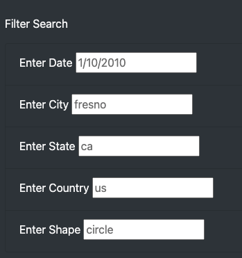
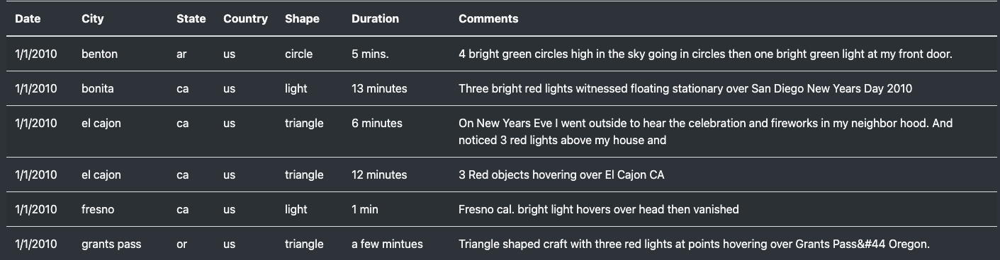

# UFOs

## Overview
Webpage was created based on data and app Javascript file. From the webpage, user can search up UFO sighting spots by entering datas on the filter section. Filters include date, city, state, country, and shape of the UFO.

## Results
Users can easily access the webpage, and once accessed, will be greeted with basic explanation on how the UFO sighting spots data was gathered. Users can filter the data by filling in the data that they want to filter out on the filtering section located on the left side of the webpage.

### 

Once the data is filled in on the filter section, filtered information will show up on the right side of the filter section.

### 
